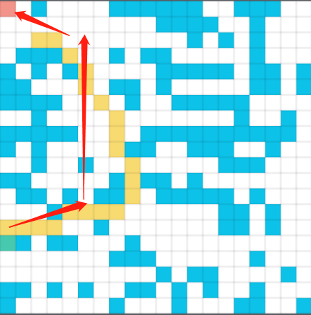

## AStar Test

根据我自己的理解写了一串 AStar 的方法在 unity 里面。
- 已经实现功能：
    1. 迷宫路径搜寻

- 仍然有的问题：
    选取的路径并非是真正的最短路径，只是相对检索长度而言最短。这个问题造成了路径在特定情况下不会最短的移动。

关联笔记：
https://note.youdao.com/web/#/file/E1B66C938E0947058A0EF09B14CBD2BB/note/WEB5d0c9218f6cb6138abe0d72acf5850d8/